# DO2_LinuxNetwork

## Part 1. Инструмент ipcalc

#### 1.1. Сети и маски

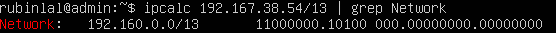  
- Определили адрес сети 192.167.38.54/13. (192.160.0.0)

 

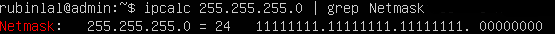  
- Перевод маски 255.255.255.0 в префиксную и двоичную запись
- В префиксной: /24 
- В двоичной: 11111111.11111111.11111111.00000000

 

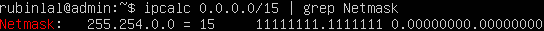  
- Перевод маски /15 в обычную и двоичную запись
- В обычной: 255.254.0.0
- В двоичной: 11111111.11111110.00000000.00000000

 

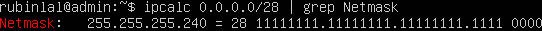  
- Перевод маски 11111111.11111111.11111111.11110000 в обычную и префиксную
- В обычной: 255.255.255.240
- В префиксной: /28

 

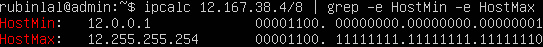  
- Минимальный и максимальный хост в сети 12.167.38.4 при маске /8

 

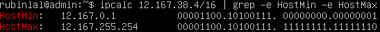  
- Минимальный и максимальный хост в сети 12.167.38.4 при маске 11111111.11111111.00000000.00000000

 

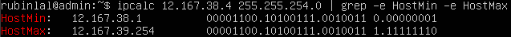  
- Минимальный и максимальный хост в сети 12.167.38.4 при маске 255.255.254.0

 

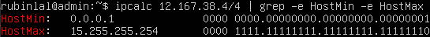  
- Минимальный и максимальный хост в сети 12.167.38.4 при маске /4

#### 1.2. localhost

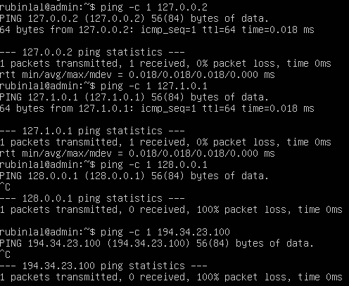  
- Определили, можно ли обратиться к приложению, работающему на localhost, со следующими IP: 194.34.23.100 и 128.0.0.1 - нет, 127.0.0.2 и 127.1.0.1 -да 
 

#### 1.3. Диапазоны и сегменты сетей

Публичные ip:
- 134.43.0.2
- 172.0.2.1
- 192.172.0.1
- 172.68.0.2
- 192.169.168.1

Частные ip:
- 10.0.0.45
- 192.168.4.2
- 172.20.250.4
- 172.16.255.255
- 10.10.10.10

Какие IP адреса шлюза возможны у сети 10.10.0.0/18:

- 10.0.0.1
- 10.10.0.2 - возможен
- 10.10.10.10 - возможен
- 10.10.100.1
- 10.10.1.255 - возможен

 

## Part 2. Статическая маршрутизация между двумя машинами

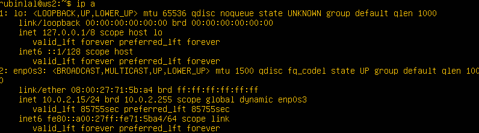 
- С помощью команды ip a посмотрели существующие сетевые интерфейсы

 

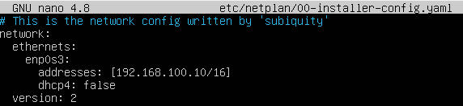  
- Описали сетевой интерфейс, соответствующий внутренней сети и задали адрес и маску на машине ws1

 

  
- Вызов команды netplan apply для перезапуска сервиса сети

 

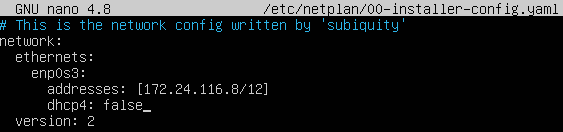  
- Описали сетевой интерфейс, соответствующий внутренней сети и задали адрес и маску на машине ws2

 

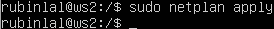  
- Вызов команды netplan apply для перезапуска сервиса сети

 

#### 2.1. Добавление статического маршрута вручную

- Добавили статические маршруты от ws1 до ws2 при помощи команды вида ip r add и пропинговали. (+  bзменили настройки сети в VB)

 

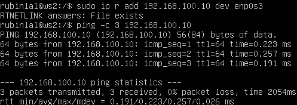  
- Добавили статические маршруты от ws2 до ws1 при помощи команды вида ip r add и пропинговали. (+  bзменили настройки сети в VB)

 

#### 2.2. Добавление статического маршрута с сохранением

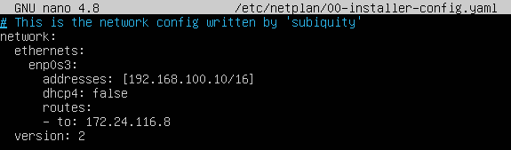  
- Добавили статический маршрут от ws1 до ws2

 

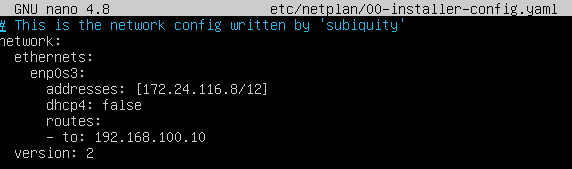  
- Добавили статический маршрут от ws2 до ws1

 

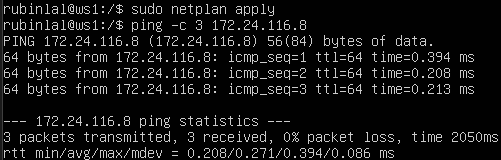 

 

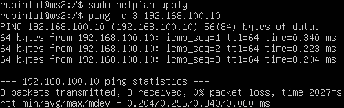  
- Пропинговали соединение между машинами

 

## Part 3. Утилита iperf3

#### 3.1. Скорость соединения
- 8 Mbps = 1 MB/s
- 100 MB/s = 819200 Kbps
- 1 Gbps = 1024 Mbps

 

#### 3.2. Утилита iperf3

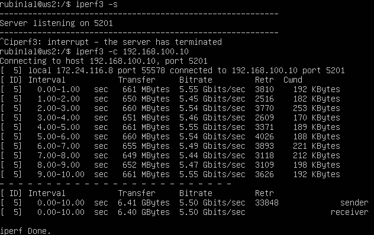  
- Скорость соединения между ws1 и ws2

 

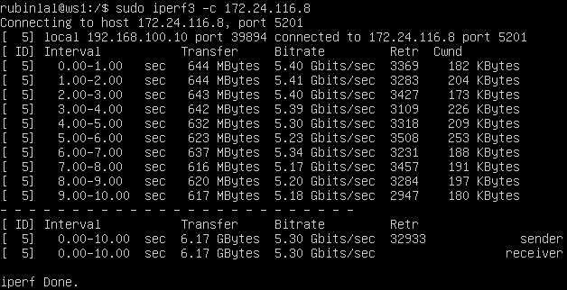  
- Скорость соединения между ws2 и ws1

 

## Part 4. Сетевой экран

#### 4.1. Утилита iptables

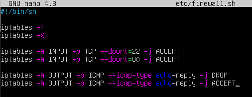  
- Прописали правила с помощью утилиты iptables, открыли порты, запретили echo reply, разрешили echo reply

 

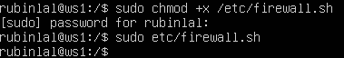  
- Запустили файл на машине ws1

 

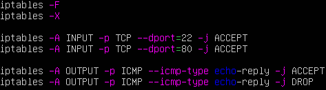  
- Прописали правила с помощью утилиты iptables, открыли порты, разрешили echo reply, запретили echo reply
- Если сначала стоит запрещающее правило, то оно имеет приоритет перед последующим разрешающим

 

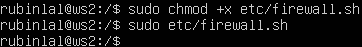  
- Запустили файл на машине ws2

 

#### 4.2. Утилита nmap

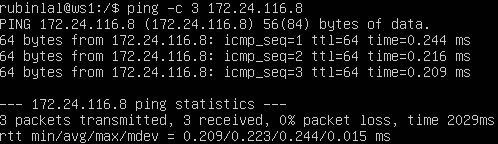  
- ws1 пингуется с ws2.

 

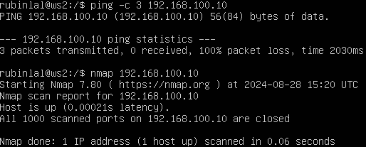  
- ws2 не пингуется c w1, но порт открыт (Host is up)

 

## Part 5. Статическая маршрутизация сети

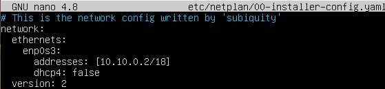  
- Файл 00-installer-config.yaml для ws11.

 

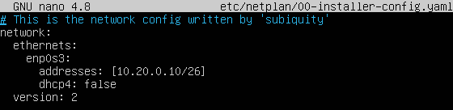  
- Файл 00-installer-config.yaml для ws21.

 

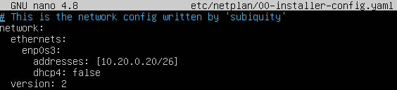  
- Файл 00-installer-config.yaml для ws22.

 

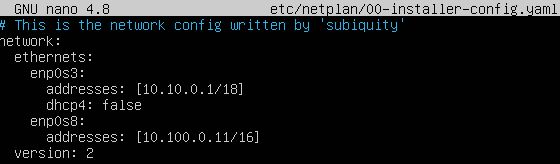  
- Файл 00-installer-config.yaml для r1.

 

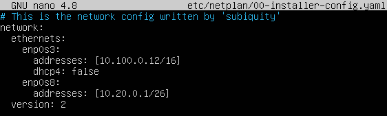  
- Файл 00-installer-config.yaml для r2.

 

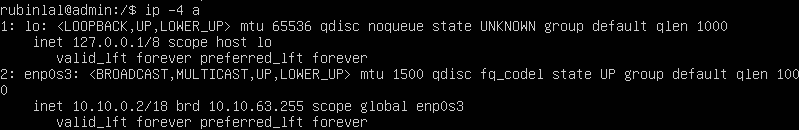  
- Командой ip -4 a проверили, что адрес машины w11 задан верно

 

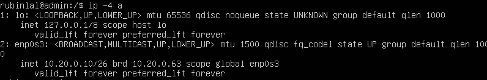  
- Командой ip -4 a проверили, что адрес машины w21 задан верно

 

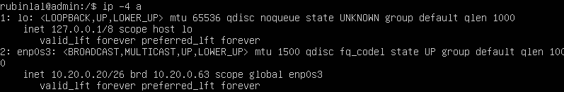  
- Командой ip -4 a проверили, что адрес машины w22 задан верно

 

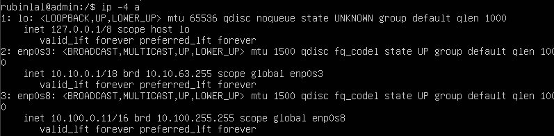 
- Командой ip -4 a проверили, что адрес машины r1 задан верно

 

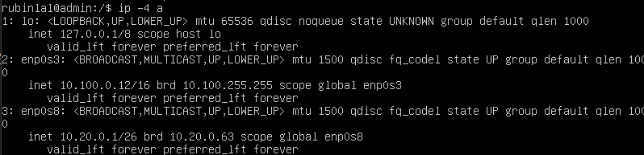 
- Командой ip -4 a проверили, что адрес машины r2 задан верно

 

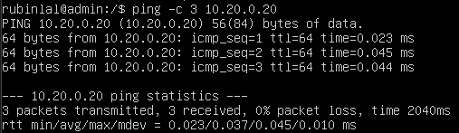 
- Пропинговали ws22 с ws21
 

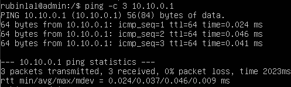 
- Пропинговали r1 с ws11

 

#### 5.2. Включение переадресации IP-адресов

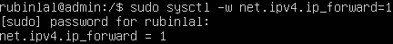 
- Для включения переадресации IP для r1 выполнили команду `sysctl -w net.ipv4.ip_forward=1`

 

 
- Для включения переадресации IP для r2 выполнили команду `sysctl -w net.ipv4.ip_forward=1`

 

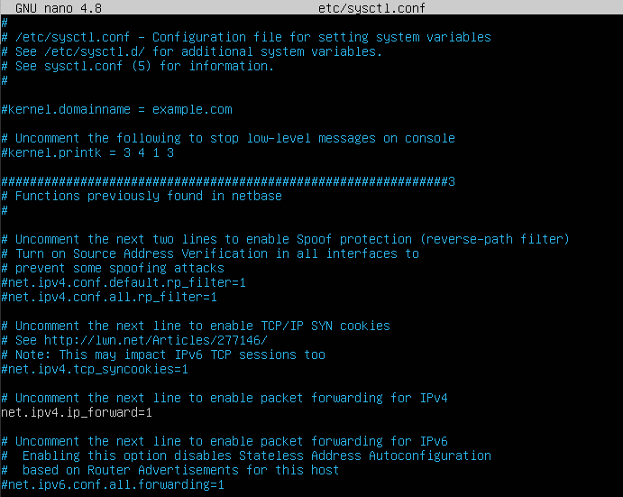
- Открыли файл /etc/sysctl.conf и добавили в него net.ipv4.ip_forward = 1 для r1 (ip переадресация включена на постоянной основе)

 

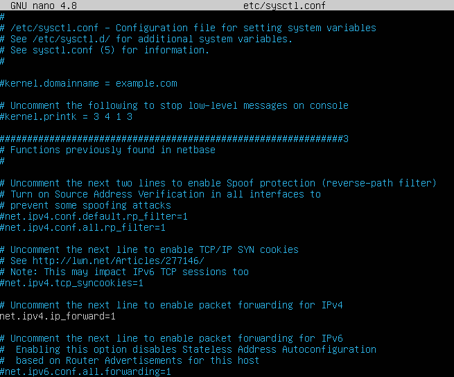  
- Открыли файл /etc/sysctl.conf и добавили в него net.ipv4.ip_forward = 1 для r2

 

#### 5.3. Установка маршрута по умолчанию

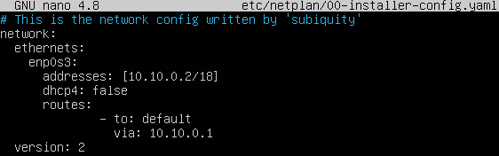 
- Добавили default перед IP-роутера в файле конфигураций ws11

 

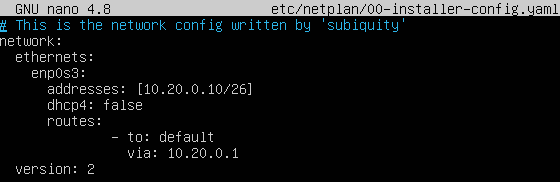 
- Добавили default перед IP-роутера в файле конфигураций ws21

 

 
- Добавили default перед IP-роутера в файле конфигураций ws22

 

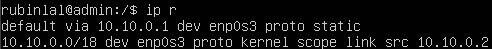 
- Вызвали ip r, добавился маршрут в таблицу маршрутизации ws11

 

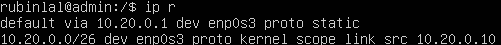  
- Вызвали ip r, добавился маршрут в таблицу маршрутизации ws21

 

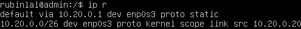  
- Вызвали ip r, добавился маршрут в таблицу маршрутизации ws22

 

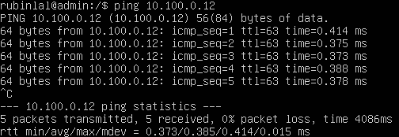  
- Пропинговали с ws11 роутер r2

 

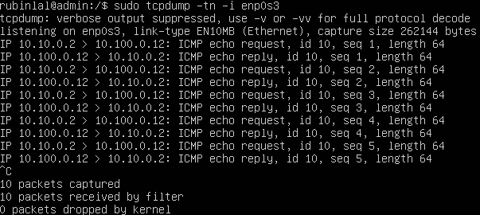  
- Проверили что пинг доходит командой tcpdump -tn -i enp0s3

 

#### 5.4. Добавление статических маршрутов

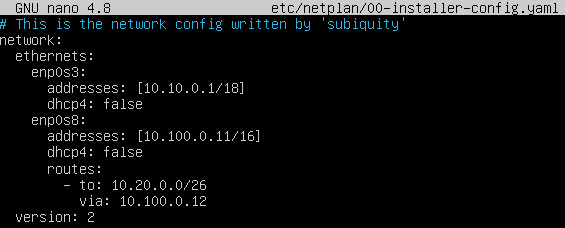  
-  Добавили в r1 статические маршруты в файле конфигураций

 

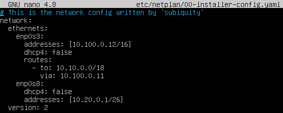  
- Добавили в r2 статические маршруты в файле конфигураций

 

  
- Показали таблицу с маршрутами на r1

 

  
- Показали таблицу с маршрутами на r2

 

  
- Запустили команды на ws11
- Для адреса 10.10.0.0/18 был выбран маршрут, отличный от 0.0.0.0/0, потому что он является адресом сети и доступен без шлюза.

 

#### 5.5. Построение списка маршрутизаторов

  
- Запустили команду traceroute на ws11(путь lj ws21)

 

  
- Запустили на r1 команду дампа `sudo tcpdump -tnv -i enp0s3`
- Утилита Traceroute отправляет три UDP-пакета на указанный порт целевого хоста, ожидая ответа о том, что этот порт недоступен. Для каждого пакета используется увеличивающееся значение TTL: первый отправляется с TTL=1, второй с TTL=2 и так далее, пока пакет не достигнет адресата. В отличие от ICMP-запроса, Traceroute отправляет UDP-запросы, которые включают порты отправителя и получателя. По умолчанию, запросы направляются на закрытый порт 34434. Когда пакет достигает целевого хоста, он отвечает сообщением «Destination port unreachable» (порт назначения недоступен), что указывает на успешное получение запроса адресатом. Traceroute интерпретирует этот ответ как завершение трассировки.

 

#### 5.6. Использование протокола ICMP при маршрутизации

  
- Пропинговали с ws11 несуществующий IP

 

  
- Запустили на r1 перехват сетевого трафика, проходящего через enp0s3

 

## Part 6. Динамическая настройка IP с помощью DHCP

  
- Указали адрес маршрутизатора по умолчанию, DNS-сервер и адрес внутренней сети для r2

 

  
- В файле resolv.conf прописали nameserver 8.8.8.8

 

- Перезагрузка службы DHCP командой `systemctl restart isc-dhcp-server`

 

  
- Через ip a показали, что машина ws21 получила адрес

 

  
- Пропинговали ws22 с ws21

 

  
- Указали MAC-адрес у ws11

 

 
- Настройка r1 (с жесткой привязкой к MAC адресу)

 

 
- Настройка DNS r1

 

   
- Перезагрузка службы DHCP командой `systemctl restart isc-dhcp-server`

 

  
- ws11 ip a после перезагрузки получили ip

 

  
- ip ws21 до обновления

 

  
- ip ws21 после обновления
- sudo dhclient -r enp0s3 освободила текущий адрес интерфейса enp0s3
- sudo dhclient enp0s3 задает новый адрес указанному интерфейсу

 

## Part 7. NAT

  
- На ws22 изменили строку Listen 80 на Listen 0.0.0.0:80, сделали сервер Apache2 общедоступным

 

  
- На r1 изменили строку Listen 80 на Listen 0.0.0.0:80, сделали сервер Apache2 общедоступным

 

  
- Запуск серверов Apache2 на r1 и ws22

 

  
- Добавление в фаервол на r2 следующих правил

 

  
- Сначала пинг с ws22 до r1 не удался

 

- Проверка соединения между ws22 и r1 командой ping. После разрешения маршрутизации icmp на r2 пинг успешен

 

- Разрешение маршрутизации icmp на r2

 

  
- Включили SNAT, а именно маскирование всех локальных ip из локальной сети, находящейся за r2 (сеть 10.20.0.0)
- Включили DNAT на 8080 порт машины r2 и добавили к веб-серверу Apache, запущенному на ws22, доступ извне сети

 

  
- Проверка соединения по TCP для SNAT, для этого с ws22 подключились к серверу Apache на r1

 

  
- Проверка соединения по TCP для DNAT, для этого с r1 подключились к серверу Apache на ws22 командой telnet (обращаться по адресу r2 и порту 8080)